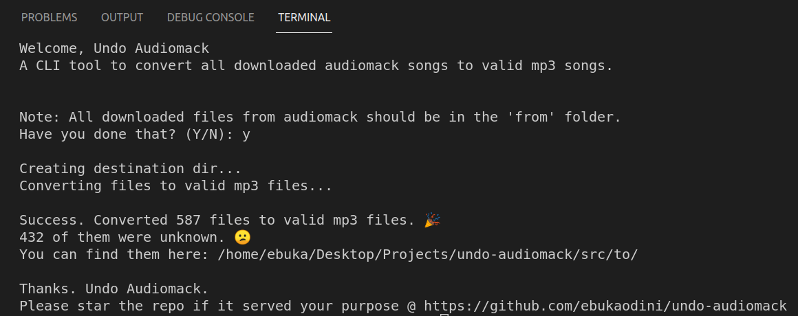

# undo-audiomack
A CLI tool to convert all downloaded audiomack songs to valid mp3 songs

## How to use

+ Clone the repository
  ```bash
  git clone https://github.com/ebukaodini/undo-audiomack.git
  ```
+ Move the downloaded audiomack files to the `src/from/` directory
+ start the program with 
  ```bash
  npm start
  ```
+ Star the repository.

## Sample Output


## Thanks
Thanks for using this program. 🙏